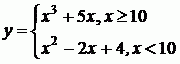

# Şərt operatoru 🎯

Sizdən aşağıdakı tapşırığı həll etmək tələb olunur. Əvvəlcə tapşırığın şərtini oxumağı unutmayın.

Tapşırıqların nümunə həllərini [instructions](../instructions) folderində tapa bilərsiniz :information_source:

#### Tapşırıqları həll etmək üçün bilməli olduğunuz mövzular

* Məntiqi şərtlər
* if operatoru
* Else if operatoru
* else operatoru
* Qısa if … else operatoru
* Məntiqi operatorlar
* Nested if operatorları
* Switch operatoru


**Yekun qeydlər**: 

* *Tapşırıqları vaxtında həll etməyi və göndərməyi unutmayın* ⏳
* *Tapşırığın həllini [main.js](./main.js) faylında yazmaq zəruridir!* :warning:

---

#### Tapşırığın şərti

Növbəti şərtə uyğun olaraq y-in qiymətini hesablayın:



#### Giriş verilənləri
x (-10000 ≤ x ≤ 10000) tam ədədi.


#### Çıxış verilənləri
Verilmiş şərtə uyğun olaraq y-in qiymətini çap edin.


---

:clock2: Zaman məhdudiyyəti 1 saniyə

:floppy_disk: Yaddaşı istafadə məhdudiyyəti 128 MiB

---

**Giriş verilənləri 1** 

```
2
```

**Çıxış verilənləri 1**

```
4
```

**Giriş verilənləri 2** 

```
20
```

**Çıxış verilənləri 2**

```
8100
```


---

**[TechAcademy](https://www.tech.edu.az/) tərəfindən yaradılıb**

---
